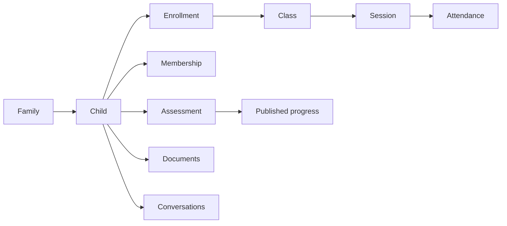

# KAFOU internal portal UX design review

**Status:** Approved for local implementation by the 20 September 2026 portal usability brief  
**Scope:** Parent, Coach, Front Desk and Owner workspaces  
**Release boundary:** Local synthetic build only. Payment Gateway and WhatsApp stay inactive.

## Evidence from the preserved starting point

The same compiled local build was opened in four isolated browser contexts at 1440 x 900 with reduced motion enabled. The screenshots and session inventory are stored under `outputs/portal-ux/before/`.

| Role | Visible destinations | Reproduced usability issue |
| --- | ---: | --- |
| Owner | 31 | One flat list mixes daily work, academy setup, finance, development, communication and governance. |
| Front Desk | 19 | The family route leads with specialist operational controls and a long edit flow instead of the child journey. |
| Coach | 12 | The assigned-session list is useful, but the home duplicates summary content and assigned students have no direct workspace. |
| Parent | 20 | Two home experiences render together and the child journey is fragmented across schedule, progress, membership and family routes. |

The existing data layer already performs server-side role and branch scoping, uses no-store requests, ignores responses from superseded account or filter epochs, and reauthorizes hydrated records. This refactor preserves those controls and changes how authorized records are organized.

## Design thesis

Operational clarity starts with the child. The portal will use a calm, compact task workspace with grouped navigation and one recognizable student context carried across front desk, coach and family views.

The visual system remains KAFOU navy and teal. Dense operational information uses short rows, clear labels and restrained cards. Large decorative dashboard blocks are removed where they compete with the next action.

## Information architecture

Every current route remains available to the roles that already have it. Desktop navigation groups routes by task; mobile keeps the four highest-frequency destinations and exposes the complete grouped map under More.

| Group | Owner / Front Desk examples | Coach examples | Parent examples |
| --- | --- | --- | --- |
| Today | Overview | Coach Today | Parent Home |
| People | Students, Families, Enquiries, Trials | Students, Assigned sessions | Family, Trials |
| Academy | Schedule, Attendance, Classes, Makeups, Events | Coaching, Progress, Events | Schedule, Progress, Makeups |
| Money | Packages, Memberships, Finance, Compensation | — | Memberships, Finance |
| Communication | Support, Coach messages, Notifications, Handover | Coach messages, Notifications | Support, Coach messages, Notifications |
| Insights and setup | Reports, Certificates, Sports, Team, Audit, Security | Reports, Recognition, Security | Reports, Certificates, Documents, Security |

The primary page action is named for its outcome: **Open arrivals**, **Open next roster**, **Manage family**, or **Add enquiry**. The ambiguous **Quick action** label is removed.

## Student workspace

The Student workspace is a projection of existing authorized entities. It does not create a second student record.

The screen has a searchable student directory at the left and a stable student panel at the right:

1. Identity, family and branch context
2. Next session and active enrollment
3. Membership/session balance for authorized staff and parents
4. Attendance and makeup status
5. Published progress, reports and certificates
6. Relevant communication and documents

Coach visibility is derived only from students present in the coach's assigned session rosters. Family contacts, finance records and unrelated children are omitted from the coach projection.

## Coach Today

The first screen answers three questions in order:

1. What is my next assigned session?
2. Which athletes are on that roster?
3. What must I do before leaving the session?

The next session receives the dominant panel with **Open roster**, **Take attendance**, and **Assess students** actions. The remaining schedule is compact and ordered. Assignment-scoped student access and the existing coach profile controls remain unchanged.

## Parent Home

The first screen begins with a child switcher, then shows the selected child's next session, membership/session balance, latest published progress and relevant actions. The screen links to schedule, makeups, family details and support without rendering a second dashboard beneath it.

Draft assessments remain hidden. Only existing published progress can appear. One family account continues to support multiple children, each with an independent journey.

## Front Desk family flow

The family and child summary appears before configuration controls. Editing contact data, adding a child and adding a sport are progressive disclosures. Specialist safety and development configuration follows the day-to-day family content.

## Cross-account consistency contract

Verification will use separate authenticated browser contexts and one guarded synthetic family journey.

| Producer | Change | Observer | Expected trigger |
| --- | --- | --- | --- |
| Front Desk | Confirm attendance / absence | Parent and Owner | Immediate navigation or manual refresh; focus refresh within the existing refresh policy |
| Parent | Request a makeup or open support | Front Desk and Owner | Immediate navigation or manual refresh; focus refresh within the existing refresh policy |
| Coach | Save assessment draft | Owner | Visible for review; hidden from Parent |
| Owner | Publish assessment | Parent and Coach | Visible after navigation or refresh |
| Unauthorized role | Request unrelated branch/student | Same session | Denied; no stale authorized record remains visible |

Failures will be classified as write failure, authorization scope, environment mismatch, record-link mismatch, stale projection, unpublished state, policy denial, or discoverability. The UI will not imply that a browser session shares client state with another account.

## Acceptance review

### 21 September refinement — current local build

The user's request for clean end-to-end UX continues the approved internal refactor. Fresh, isolated Parent, Coach, Front Desk and Owner sessions reproduced the starting screens (saved in `outputs/ux-refinement-2026-09-21/before`). The two existing portal journey checks passed before changes.

The refinement keeps the six Parent destinations and all existing role routes. Secondary Parent pages highlight their owning primary destination; compact, wrapping section controls replace large duplicate section headers. The child selector remains visible with a single accessible label. Dates and global task shortcuts belong on Today/Home; working pages retain refresh and branch scope beside their title. Coach profile and availability become an expandable section after the daily work, retaining mounted form state. Student search shows a genuine no-results state rather than a previously selected, nonmatching child. Shared controls receive consistent alignment, keyboard focus and selected-state contrast. No backend, public-site or provider changes are included.

Verification compares matching desktop/mobile screenshots, tests secondary-route selection and empty search recovery, checks English/Arabic overflow and keyboard access, and reruns the connected local workflow suite. This is local usability refinement, not hosted or customer acceptance.

- All existing role permissions and server-side scopes remain in place.
- Every existing destination remains reachable through grouped navigation.
- Owner, Front Desk, Coach and Parent have distinct first screens.
- Student workspace uses current records and does not duplicate the domain model.
- Parent and Coach no longer render two overview dashboards.
- Family editing follows the family and child summary.
- English, Arabic RTL, keyboard navigation, reduced motion and 200% zoom receive visual review.
- Before and after screenshots use the same viewport and synthetic fixture.
- Regression evidence includes real journeys, denied access and visible state transitions, not test totals alone.

## 21 September — operational directory correction

The user rejected the current Customers screenshot: enormous one-line child rows, inconsistent Families/Customers labels, and no useful directory. This continues the explicitly authorized local internal UX refactor. The design direction presented in the task is searchable tables, focused record panels, a day/week session calendar, and consistent Owner/Front Desk navigation. The current implementation preserves every existing command and authorization boundary.

- Customers opens a family directory searchable by family, contact, or child; Manage family opens contact/child editors in the existing guarded drawer.
- Trials opens a compact admissions table with booked date and status. Manage trial retains eligible booking, level review, conversion and cancellation actions. Enrollment records use a separate compact table and no longer make unsupported payment claims.
- Classes separates catalogue and calendar views. The catalogue exposes coach, venue, level, capacity and status. The calendar supports week/day, date navigation, search and roster access.
- Attendance opens a session register; a selected roster contains the existing finalize/correct/complete controls. Waitlists and transfers become secondary disclosures.
- Customer page titles, top breadcrumbs and navigation agree. Branch context remains persistent but compact. Parent primary navigation and backend policies are unchanged.
- Tables and calendars describe their loaded-record boundary. This is not a new server-wide search or a complete date-range scheduling query. Existing workspace search and Load more remain available.

Before/after evidence and the current release verification are in `outputs/admin-experience-2026-09-21/`. Visual acceptance by the user remains pending; passing regression checks alone is not acceptance.
